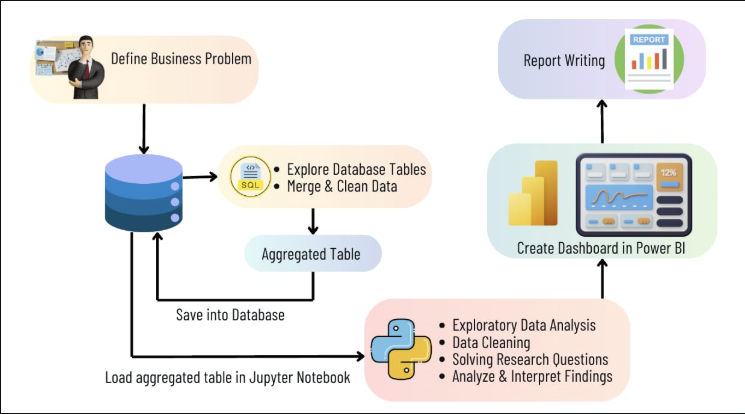
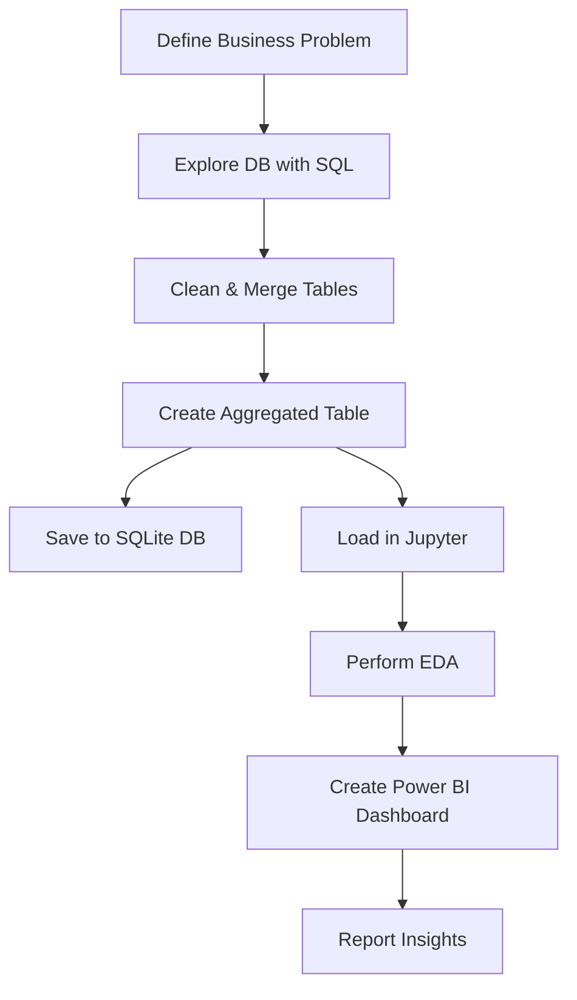
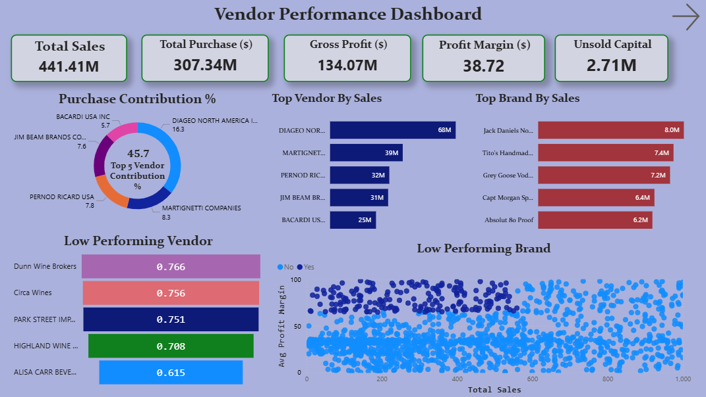
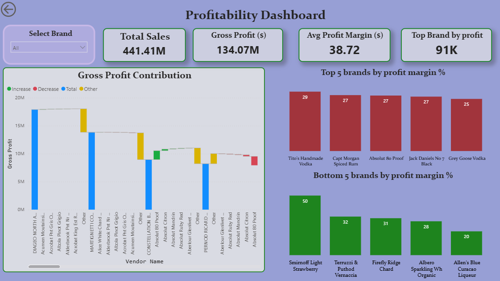

# 📦 Vendor Performance Analysis Project

Vendor Performance Analysis involves systematically evaluating how effectively suppliers contribute to an organization’s success. This includes assessing key factors such as product quality, cost efficiency, delivery timeliness, reliability, and the overall value they provide.


---

## Project Workflow



## Business Problem

Companies often face losses due to poor inventory practices, inefficient pricing strategies, and vendor over-dependence. This analysis aims to:

- Identify underperforming brands needing promotional or pricing adjustments.
- Determine top vendors contributing to sales and gross profit.
- Analyze the effect of bulk purchasing on unit cost.
- Assess inventory turnover to improve efficiency and reduce holding costs.
- Investigate profitability variance between high- and low-performing vendors

## Tools & Technologies

| Tool        | Purpose                         |
|-------------|----------------------------------|
| **Python**  | Data analysis & scripting        |
| **Pandas**  | Data manipulation                |
| **SQL**     | Data extraction from SQLite      |
| **Power BI**| Dashboard creation               |
| **Jupyter** | EDA & visualization              |
| **Matplotlib/Seaborn** | Visual analytics     |

---

## Database Connection

To run the analysis, establish a connection to the SQLite database:

```python
from sqlalchemy import create_engine
import pandas as pd
import sqlite3

# Create a SQLAlchemy engine to connect to the SQLite database named 'inventory.db'
engine = create_engine('sqlite:///inventory.db')

# Connect to the SQLite database file
conn = sqlite3.connect('inventory.db')

# Checking tables present in the database
tables = pd.read_sql_query(
    "SELECT name FROM sqlite_master
     WHERE type='table' ORDER BY name ASC", conn
)
tables


```

## Data Aggregation using SQL (Final Query)
The query below creates the final `vendor_sales_summary` by joining purchase, sales, and freight data using Common Table Expressions (CTEs):

```python
vendor_sales_summary = pd.read_sql_query("""
WITH FreightSummary AS (
    SELECT
        VendorNumber, 
        SUM(Freight) AS FreightCost 
    FROM vendor_invoice
    GROUP BY VendorNumber
), 
PurchaseSummary AS (
    SELECT
        p.VendorNumber,
        p.VendorName,
        p.Brand, 
        p.Description, 
        p.PurchasePrice, 
        pp.Volume, 
        pp.Price AS ActualPrice,
        SUM(p.Quantity) AS TotalPurchaseQuantity,
        SUM(p.Dollars) AS TotalPurchaseDollars
    FROM purchases p
    JOIN purchase_prices pp
        ON p.Brand = pp.Brand
    WHERE p.PurchasePrice > 0
    GROUP BY 
        p.VendorNumber, p.VendorName, p.Brand, p.Description, p.PurchasePrice, pp.Price, pp.Volume
),
SalesSummary AS (
    SELECT 
        VendorNo, 
        Brand, 
        SUM(SalesDollars) AS TotalSalesDollars,
        SUM(SalesPrice) AS TotalSalesPrice,
        SUM(SalesQuantity) AS TotalSalesQuantity,
        SUM(ExciseTax) AS TotalExciseTax
    FROM sales
    GROUP BY VendorNo, Brand
)
SELECT 
    ps.VendorNumber,
    ps.VendorName, 
    ps.Brand,
    ps.Description, 
    ps.PurchasePrice, 
    ps.ActualPrice,
    ps.Volume, 
    ps.TotalPurchaseQuantity, 
    ps.TotalPurchaseDollars,
    ss.TotalSalesQuantity,
    ss.TotalSalesDollars,
    ss.TotalSalesPrice,
    ss.TotalExciseTax,
    fs.FreightCost
FROM PurchaseSummary ps 
LEFT JOIN SalesSummary ss
    ON ps.VendorNumber = ss.VendorNo
    AND ps.Brand = ss.Brand
LEFT JOIN FreightSummary fs
    ON ps.VendorNumber = fs.VendorNumber
ORDER BY ps.TotalPurchaseDollars DESC
""", conn)

```


## 📂 Folder Structure

```
Vendor_Performance_Analysis/
│
├── data/
│   └── inventory.db                  # SQLite database 
│
├── sql/                               # SQL scripts for data cleaning and aggregation
│
├── notebooks/
│   └── Vendor_Performance_Analysis.ipynb  # Main notebook
│
│
├── logs/
│   └── ingestion.log                 # Logs for ETL operations
│
├── scripts/
│   └── ingest_to_db.py              # Save aggregated table to DB
│
├── powerbi/
│   └── dashboard.pbix               # Power BI dashboard file
│
├── report/
│   └── final_report.pdf             # Business summary
│
└── README.md                        # Project documentation
```
Access the "data" file here: https://drive.google.com/file/d/1OycGXzQfY5aKn1kbR07l_Qw7pQ_hlrkp/view?usp=sharing
---


## Data Pipeline Overview



---

## Power BI Dashboard Preview

Below is a preview of the Power BI dashboard showing key vendor KPIs:
 


> 📁 File: [`Inventory_Management.pbix`](https://app.powerbi.com/view?r=eyJrIjoiNTA4MzAyYjctNTY4NC00YzNlLWEzMGUtMDc4ZTdkNDhkOWVjIiwidCI6IjQyYjUxMzUzLTZhMzctNDA5Zi1hMmZlLTc3OGE5YmUzMTllNCJ9)

---

## Report Summary

The final report includes:
    - Project Objectives
    - Analytical Approach
    - Major Findings
    - Strategic Recommendations   

📁 File: `report/final_report.pdf`

---

## Outcomes & Insights

- Identified top and low-performing vendors based on delivery time and rating
- Highlighted cost-effectiveness of certain vendors
- Suggested potential areas for renegotiation and vendor replacement

---

## Author

**Hritish Mahajan**  
*Data Analysis | Python | SQL | Power BI | Machine Learning |*

📧 Contact: *hritishx@gmail.com*  
🔗 GitHub: [github.com/hritishmahajan](https://github.com/hritishmahajan)
